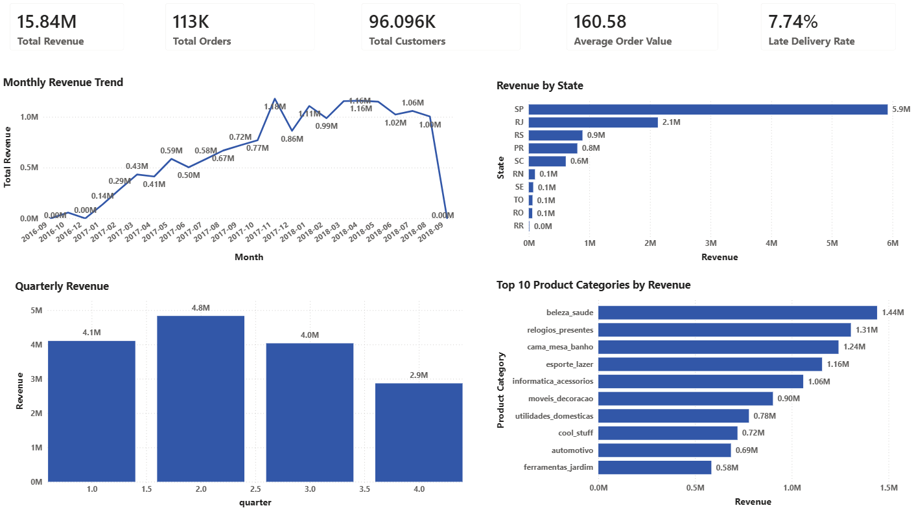
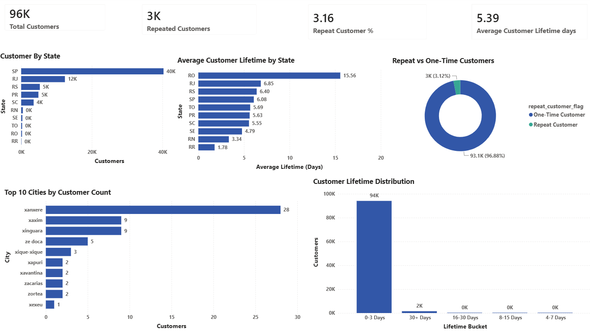
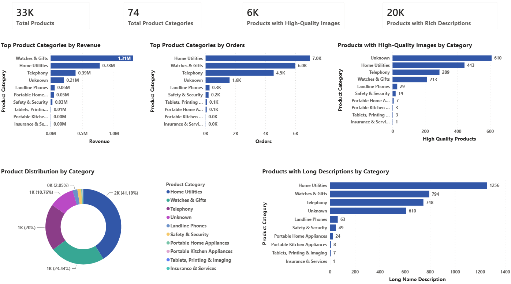
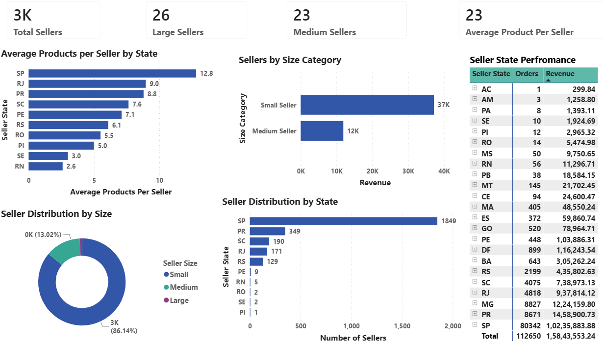
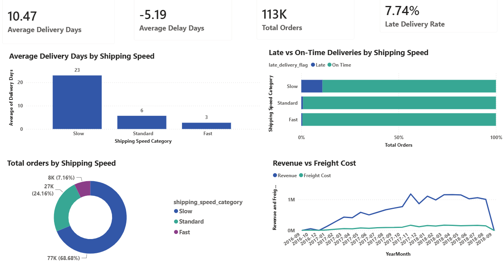
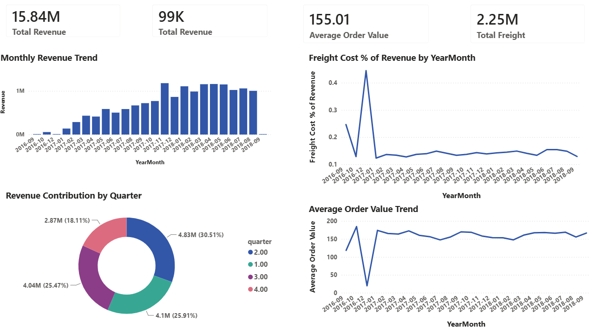

# E-Commerce Intelligence Platform

### Project Highlights

- End-to-end **Business Intelligence & Analytics Platform** built on the Olist Brazilian E-Commerce Dataset **(100K+ orders)**.
- Transforms raw marketplace data into business-ready insights using **PostgreSQL, SQL, Star Schema, and Power BI**.
- Implements a layered analytics architecture (Raw → Staging → Intermediate → Analytics → Data Marts).
- Develops subject-oriented **data marts** for efficient business reporting and analysis.
- Delivers **6 interactive Power BI dashboards** covering Executive, Customer, Product, Seller, Delivery, and Revenue Analytics.
- Enables KPI monitoring, business performance analysis, and data-driven decision-making through interactive visualizations.
  
#  End-to-End Project Workflow

The project follows a real-world analytics workflow that mirrors the architecture commonly adopted in modern Business Intelligence teams. Raw marketplace data is progressively transformed into validated analytical datasets before being consumed by executive dashboards and business reports.

```text
                    Olist Brazilian E-Commerce Dataset
                                   │
                                   ▼             
                 Data Validation, Cleaning & Transformation
                                   │
                                   ▼
                    PostgreSQL Data Warehouse (Raw Layer)
                                   │
                                   ▼
                         Staging Data Model
                                   │
                                   ▼
                     Analytics Data Warehouse Layer
                                   │
                                   ▼
             Business-Oriented Analytics Marts (Star Schema)
                                   │
                                   ▼
                      Business KPIs & SQL Analytics
                                   │
                                   ▼
                 Interactive Power BI Executive Dashboard
                                   │
                                   ▼
           Business Insights & Strategic Recommendations
```
#  Business Problem

- Monitoring executive KPIs through a centralized analytics platform.
- Understanding customer behavior, retention, and purchasing patterns.
- Evaluating product and seller performance to identify key revenue drivers.
- Measuring revenue trends, geographic sales distribution, and marketplace growth.
- Tracking delivery performance, freight costs, and operational efficiency.
- Eliminating fragmented reporting by transforming raw operational data into business-ready analytical models.

# Business Objectives

- Design a layered analytics pipeline to transform raw marketplace data into business-ready analytical models.
- Build a PostgreSQL data warehouse using a **Star Schema** and subject-oriented **data marts** for scalable analytics.
- Monitor marketplace performance through executive KPIs, including revenue, orders, customers, average order value, freight cost, and delivery metrics.
- Analyze customer, product, seller, revenue, and delivery performance to identify business trends and operational opportunities.
- Develop interactive Power BI dashboards that enable dynamic filtering, drill-through analysis, and KPI monitoring for data-driven decision-making.

#  Dashboard

The platform includes a **6-page interactive Power BI dashboard**.Each analytics module focuses on a distinct business domain while supporting cross-filtering, drill-through navigation, and KPI-driven decision-making.

---

##  Executive Analytics

Executive overview of marketplace performance with high-level business KPIs, revenue trends, product performance, and regional sales distribution.



---

##  Customer Analytics

Customer behavior analysis including customer distribution, repeat customer metrics, customer lifetime analysis, and geographic customer insights.



---

##  Product Analytics

Evaluation of product category performance through revenue contribution, order volume, product distribution, and product content quality.



---

##  Seller Analytics

Marketplace seller performance including seller revenue, seller distribution, seller segmentation, and seller performance comparison.



---

##  Delivery Analytics

Logistics performance analysis covering shipping speed distribution, delivery duration, delivery delays, and operational delivery metrics.



---

##  Revenue Analytics

Financial performance monitoring through revenue trends, quarterly contribution, average order value, freight cost analysis, and revenue comparison.


---

The workflow separates data ingestion, transformation, analytics modeling, and visualization into independent layers, creating a scalable architecture that supports reliable business reporting and future analytical enhancements.

---
#  Tech Stack
| Category | Technologies |
|----------|--------------|
| **Database** | PostgreSQL |
| **Query Language** | SQL |
| **Business Intelligence** | Power BI (DAX) |
| **Version Control** | Git, GitHub |
| **Dataset** | Olist Brazilian E-Commerce Dataset |
| **Data Warehouse Architecture** | Layered Data Warehouse (Staging → Intermediate → Analytics) |
| **Data Modeling** | Star Schema, Fact & Dimension Modeling, Data Marts |
| **Data Validation** | Volume Validation, Null Validation, Duplicate Validation, Domain Validation, Relationship Validation, Business Rule Validation |
| **Business Analytics** | KPI Development, Business Metrics, Data Quality Validation, Executive Reporting |
---
#  Executive Business KPIs

The dashboard consolidates business performance into executive-level Key Performance Indicators (KPIs) that provide a comprehensive overview of marketplace health.

| KPI | Business Purpose |
|------|------------------|
| **Total Revenue** | Measure total marketplace revenue generated from completed orders. |
| **Total Orders** | Track overall order volume across the marketplace. |
| **Total Customers** | Monitor marketplace customer base. |
| **Average Order Value (AOV)** | Evaluate average customer spending per order. |
| **Total Freight Cost** | Measure logistics expenditure associated with deliveries. |
| **Repeat Customers** | Assess customer retention and repeat purchasing behavior. |
| **Average Customer Lifetime** | Understand customer engagement duration. |
| **Total Products** | Monitor marketplace catalog size. |
| **Total Sellers** | Track active marketplace sellers. |
| **Average Delivery Days** | Evaluate overall delivery efficiency. |
| **Average Delivery Delay** | Monitor delivery performance against expected timelines. |
| **Late Delivery Rate** | Measure the proportion of delayed deliveries across the marketplace. |

---

#  SQL Analytics Pipeline

The project implements a layered SQL analytics architecture that transforms raw transactional data into validated, business-ready analytical datasets. Each layer has a clearly defined responsibility, ensuring scalability, maintainability, and reliable business reporting.

The SQL pipeline consists of the following stages:

### Raw Data Layer
- Raw dataset ingestion
- Source table creation
- Initial data validation

### Staging Layer
- Data cleaning
- Standardization
- Data quality validation
- Relationship validation

### Analytics Layer
- Fact table development
- Dimension table development
- Business-oriented analytics marts
- KPI generation
- Business aggregation queries

### Reporting Layer
- Power BI data model
- Interactive dashboards
- Executive KPIs
- Business reporting

The layered architecture separates data ingestion, transformation, analytics, and reporting, closely following enterprise Business Intelligence development practices.

#  Data Warehouse Architecture

The project follows a layered PostgreSQL data warehouse architecture that separates data ingestion, transformation, analytics modeling, and reporting into independent components. This design improves data quality, simplifies maintenance, and provides a scalable foundation for business intelligence reporting.

```text
                           Olist Dataset
                                 │
                                 ▼
                          Raw Data Layer
                                 │
                                 ▼
                         Staging Data Layer
                                 │
                                 ▼
                      Analytics Data Warehouse
                                 │
                 ┌───────────────┼────────────────┐
                 │               │                │
                 ▼               ▼                ▼
          Fact Tables     Dimension Tables   Analytics Marts
                 │               │                │
                 └───────────────┼────────────────┘
                                 │
                                 ▼
                         Power BI Semantic Model
                                 │
                                 ▼
                    Executive Business Dashboards
```

### Architecture Components

| Layer | Purpose |
|--------|---------|
| **Raw Layer** | Stores imported source data without business transformations. |
| **Staging Layer** | Cleans, validates, standardizes, and prepares data for analytics. |
| **Analytics Layer** | Builds fact tables, dimension tables, and business-oriented analytical marts. |
| **Semantic Layer** | Provides optimized datasets for Power BI reporting and KPI analysis. |
| **Visualization Layer** | Presents executive dashboards and interactive business reports. |

This architecture follows modern Business Intelligence design principles by separating operational data processing from analytical reporting, improving scalability, maintainability, and reporting performance.

---

#  Analytics Marts

To support domain-specific business analysis, the project organizes analytical datasets into dedicated business marts. Each mart is designed around a specific functional area, enabling focused reporting while maintaining a consistent enterprise data model.

| Analytics Mart | Business Purpose |
|----------------|------------------|
| **Sales Mart** | Revenue analysis, order performance, average order value, and freight cost monitoring. |
| **Customer Mart** | Customer distribution, repeat purchasing behavior, customer lifetime analysis, and geographic customer insights. |
| **Product Mart** | Product category performance, order volume, product distribution, and product content quality analysis. |
| **Seller Mart** | Seller performance, seller segmentation, marketplace contribution, and geographic seller analysis. |
| **Delivery Mart** | Delivery duration, shipping speed analysis, delivery delays, and logistics performance monitoring. |

### Supporting Data Model

The analytics marts are supported by a dimensional data model consisting of:

- Fact Sales
- Customer Dimension
- Product Dimension
- Seller Dimension
- Date Dimension

This business-oriented data model enables efficient aggregation, simplified reporting, and scalable dashboard development while supporting multiple analytical perspectives across the marketplace.


#  Key Business Insights

The integrated analytics platform uncovered several business patterns across customers, products, sellers, revenue, and delivery operations that can support strategic decision-making.

### Executive Performance
- Marketplace revenue is concentrated within a limited number of product categories, highlighting opportunities for category-specific growth strategies.
- Revenue and order volume exhibit noticeable monthly and quarterly variations, indicating seasonal purchasing behavior.

### Customer Analytics
- The marketplace is primarily driven by one-time purchasers, while repeat customers represent a comparatively smaller share of the customer base.
- Customer purchasing activity varies across geographic regions, providing opportunities for targeted regional marketing initiatives.

### Product Analytics
- A small number of product categories contribute a significant proportion of marketplace revenue and order volume.
- Product content quality (images and descriptions) differs across categories, suggesting opportunities to improve catalog completeness and customer experience.

### Seller Analytics
- Seller contribution is uneven across the marketplace, with a relatively small group of sellers generating a large share of total revenue.
- Seller distribution varies geographically, highlighting regional marketplace concentration.

### Delivery Analytics
- Delivery performance differs across shipping speed categories.
- Monitoring delivery duration and late delivery rates can help identify operational inefficiencies within the logistics process.

### Revenue Analytics
- Revenue growth, freight costs, and average order value exhibit different temporal patterns, enabling continuous monitoring of marketplace profitability and operational performance.


#  Business Recommendations

Based on the analytical findings, the following business strategies are recommended:

- Prioritize investment in high-performing product categories while identifying growth opportunities within underperforming categories.
- Strengthen customer retention initiatives to increase repeat purchasing behavior and improve long-term customer value.
- Improve product catalog quality by encouraging sellers to provide richer product descriptions and higher-quality product images.
- Develop seller performance programs that reward high-performing sellers while supporting lower-performing sellers through marketplace enablement initiatives.
- Continuously monitor delivery performance and late delivery rates to improve customer satisfaction and logistics efficiency.
- Track executive KPIs through interactive Power BI dashboards to support faster and more informed business decision-making.
- Leverage the analytics platform as a centralized decision-support system for monitoring marketplace performance and identifying future business opportunities.

#  Repository Structure

```text
ecommerce-intelligence-system/
│
├── dashboard/
│
├── data/
│   └── raw/
│
├── docs/
│   ├── data_model.md
│   └── metric_definitions.md
│
├── images/
│   ├── dashboard_overview.png
│   ├── executive_analytics.png
│   ├── customer_analytics.png
│   ├── product_analytics.png
│   ├── seller_analytics.png
│   ├── delivery_analytics.png
│   └── revenue_analytics.png
│
├── sql/
│   ├── 01_staging/
│   ├── 02_validation/
│   ├── 03_intermediate/
│   ├── 04_analytics/
│   ├── 05_marts/
│   ├── 06_metrics/
│   ├── 07_quality/
│   └── 08_dashboard/
│
├── src/
│
├── tests/
│
├── .gitignore
├── README.md
└── requirements.txt
```

#  Project Files

| File | Description |
|------|-------------|
|  **EDA Notebook** | Exploratory Data Analysis, data understanding, missing value analysis, and business insights. |
|  **SQL Scripts** | Database creation, data validation, staging layer, analytics marts, KPI generation, and business queries. |
|  **Power BI Dashboard** | Interactive multi-page business intelligence dashboard with executive and operational analytics. |
|  **Presentation** | Business presentation summarizing project objectives, architecture, analytics, insights, and recommendations. |
|  **Documentation** | Data model, architecture, data dictionary, and project documentation. |

---

#  Future Improvements

The current implementation establishes a scalable analytics foundation that can be extended with additional Business Intelligence capabilities.

Potential future enhancements include:

- Deploy dashboards using **Power BI Service** for enterprise reporting.
- Implement Row-Level Security (RLS) to support role-based dashboard access.
- Expand the analytics model with additional business marts and KPIs.
- Automate data ingestion and refresh workflows for continuous reporting.
- Integrate predictive analytics models to support demand forecasting and marketplace optimization.

---

#  Business Impact

This project demonstrates how modern Business Intelligence and analytics can transform raw marketplace data into actionable business insights by:

- Establishing a scalable end-to-end analytics platform using PostgreSQL, SQL, Python, and Power BI.
- Providing executives with centralized KPI monitoring across revenue, customers, products, sellers, and delivery operations.
- Supporting data-driven decision-making through interactive dashboards and business-oriented analytics marts.
- Improving business visibility by consolidating operational data into a unified analytical model.
- Enabling continuous monitoring of marketplace performance, customer behavior, operational efficiency, and revenue trends.
- Demonstrating enterprise-style data warehousing, analytics engineering, and dashboard development practices applicable to real-world business environments.

---

# Author

**Kanishka Tulya**

**Data Analytics | Business Intelligence | SQL | PostgreSQL | Python | Power BI**

